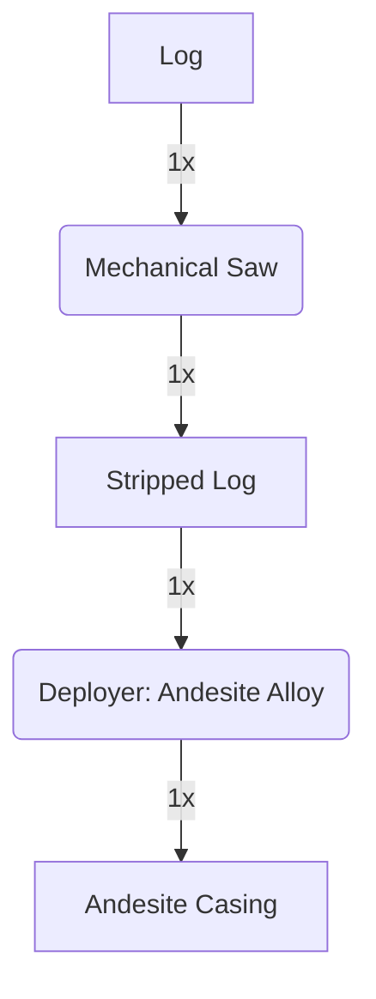

---
tags:
  - recipes
  - recipes/casings
  - inputs/logs
  - inputs/andesite_alloy
  - outputs/andesite_casing
---

### Inputs
- 1x Log
- 1x Andesite Alloy

### Requires
- Deployer
- Mechanical Saw

### Outputs
- 1x Andesite Casing

### Workflow Diagram

