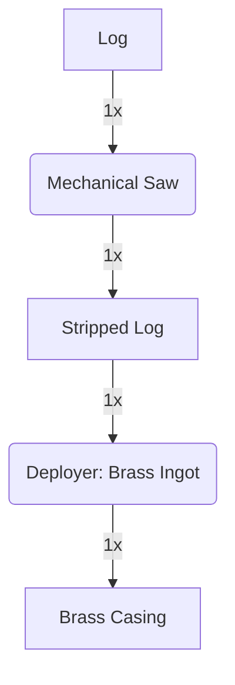

---
tags:
  - recipes
  - recipes/casings
  - inputs/logs
  - inputs/brass_ingot
  - outputs/brass_casing
---

### Inputs
- 1x Log
- 1x [[Brass Ingot]]

### Requires
- Deployer
- Mechanical Saw

### Outputs
- 1x Brass Casing

