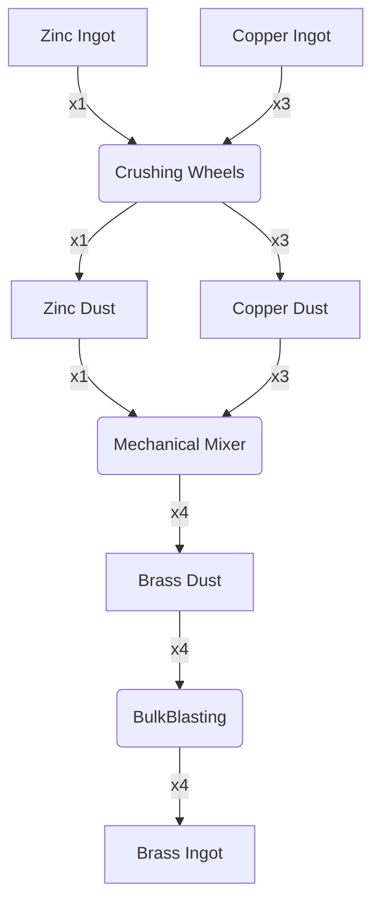

---
tags:
  - recipes
  - recipes/ingots
  - inputs/copper_ingot
  - inputs/zinc_ingot
  - outputs/brass_ingot
---

### Inputs

- 1x Zinc Ingot
- 3x Copper Ingot

### Requires

- Crushing Wheel
- Automated Shapeless Crafting
- Bulk Blasting: Lava

### Outputs

- 4x Brass Ingot

### Workflow Diagram

