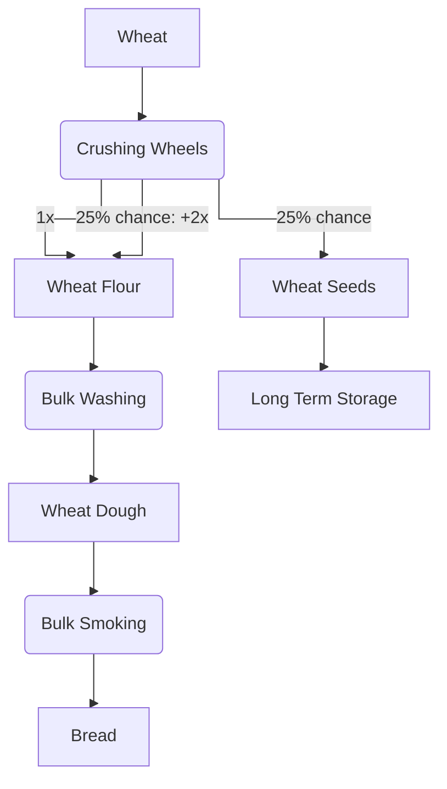

---
tags:
  - recipes
  - recipes/food
  - recipes/bread
  - inputs/wheat
  - inputs/wheat_seeds
  - inputs/wheat_flour
  - inputs/wheat_dough
  - outputs/bread
---

### Inputs
- 1x wheat

### Requires
- Bulk Smoking: Campfire
- Bulk Washing: Water

### Outputs
- 1-3 Bread

## Steps

### 1. Crush Wheat

**Uses**:
- 2x Crushing Wheel
**Produces**:
- 1-3x Wheat Flour

### 2. Bulk Wash Wheat Flour
**Uses**:
- Encased fans + water sources
- 1x Wheat Flour
**Produces**:
- 1x Wheat Dough

### 3. Bulk Smoking Wheat Dough
**Uses**:
- Encased fans + Campfire sources
- 1x Wheat Dough
**Produces**:
- 1x Bread

