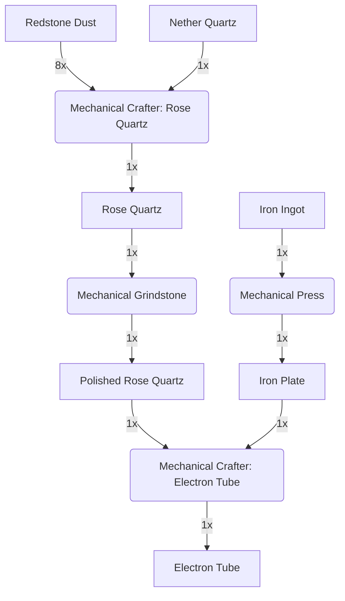

---
tags:
  - recipes
  - recipes/items
  - inputs/nether_quartz
  - inputs/redstone
  - inputs/iron_ingot
  - outputs/electron_tube
---
### Inputs
- 8x Redstone Dust
- 1x [[Nether Quartz]]
- 1x Iron Ingot

### Requires
- Mechanical Press
- Mechnical Grindstone
- Mechanical Crafter

### Outputs
- 1x Electron Tube

### Workflow Diagram

