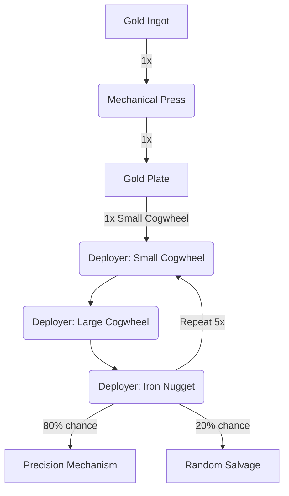

---
tags:
  - recipes
  - recipes/items
  - inputs/gold_ingot
  - inputs/small_cogwheel
  - inputs/large_cogwheel
  - inputs/iron_nugget
  - outputs/precision_mechanism
  - outputs/random_salvage
---

### Inputs
- 1x Gold Ingot
- 5x [[Small Cogwheel]]
- 5x [[Large Cogwheel]]
- 5x Iron Nugget

### Requires
- Deployer
- Mechanical Press

### Outputs
- 80% chance - 1x Precision Mechanism
- 20% chance - "random salvage"

