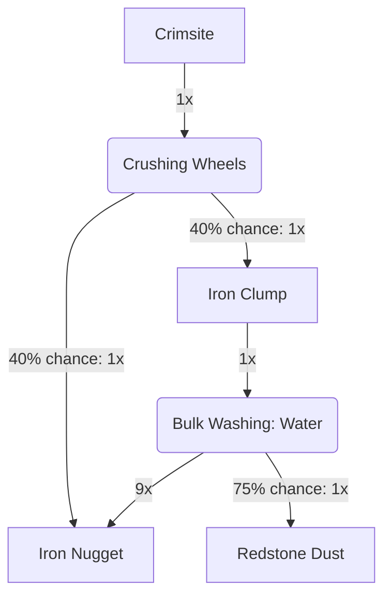

---
tags:
  - recipes
  - inputs/crimsite
  - outputs/redstone_dust
  - outputs/iron_nuggets
---
### Inputs
- 64x Crimsite

### Requires
- Crushing Wheels
- Bulk Washing: Water

### Outputs

> [!info]  
> These outputs are based on random chance. These numbers are based on expected values derived from long-term averages.

- 256x Iron Nugget
- 19x Redstone Dust

