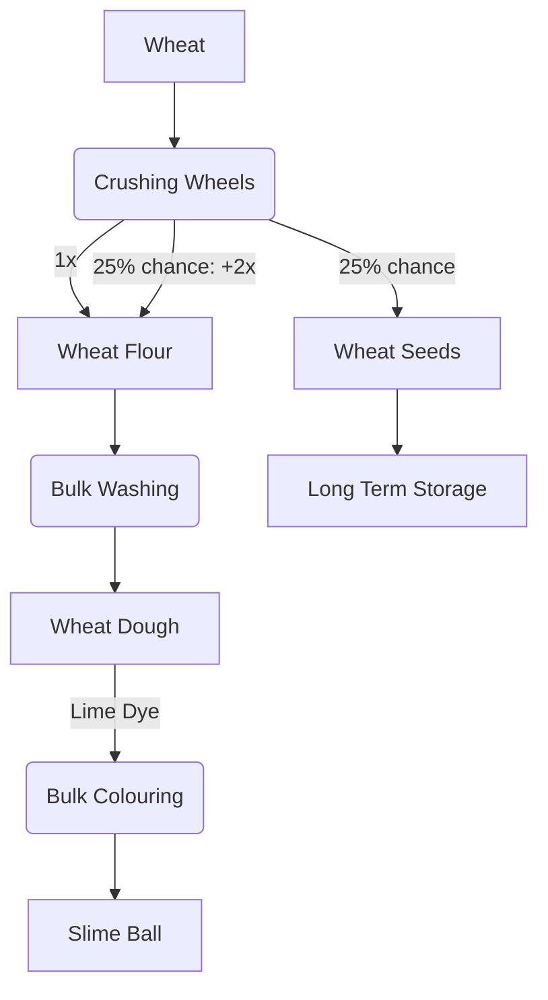

---
tags:
  - recipes
  - recipes/slime_ball
  - inputs/wheat
  - inputs/wheat_seeds
  - inputs/wheat_flour
  - inputs/wheat_dough
  - outputs/slime_ball
---

### Inputs

- 1x wheat

### Requires

- Bulk Colouring: Lime Dye liquid
- Bulk Washing: Water

### Outputs

- 1-3x Slime Balls

### Workflow Diagram

## Steps

### 1. Crush Wheat

**Uses**:

- 2x Crushing Wheel **Produces**:
- 1-3x Wheat Flour

### 2. Bulk Wash Wheat Flour

**Uses**:

- Encased fans + water sources
- 1x Wheat Flour **Produces**:
- 1x Wheat Dough

### 3. Bulk Colouring Wheat Dough

**Uses**:

- Encased fans + lime dye sources
- 1x Wheat Dough **Produces**:
- 1x Slime Ball

****
