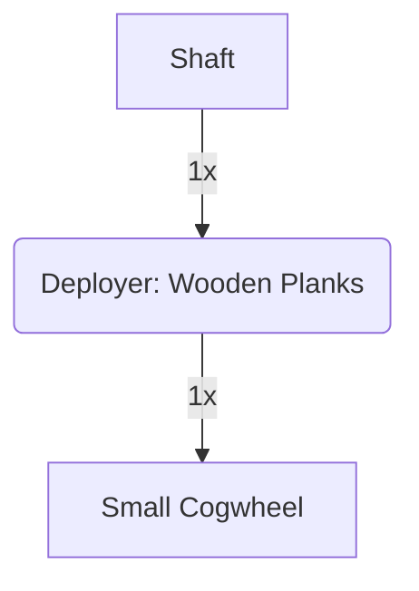

---
tags:
  - recipes
  - recipes/blocks
  - inputs/shaft
  - inputs/wooden_planks
  - outputs/small_cogwheel
---
### Inputs
- 1x Shaft
- 1x Wooden Planks

### Requires
- Deployer

### Outputs
- 1x Small Cogwheel

Addendum: This is a test to see how well things work with the auto-sync