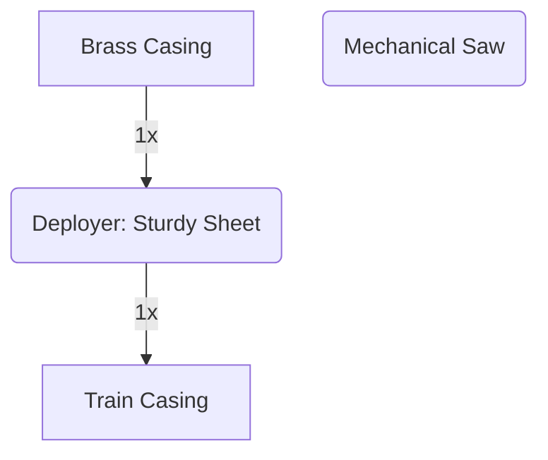

---
tags:
  - recipes
  - recipes/casings
  - inputs/brass_casing
  - inputs/sturdy_sheet
  - outputs/train_casing
---

### Inputs
- 1x [[Brass Casing]]
- 1x Sturdy Sheet

### Requires
- Deployer

### Outputs
- 1x Train Casing

